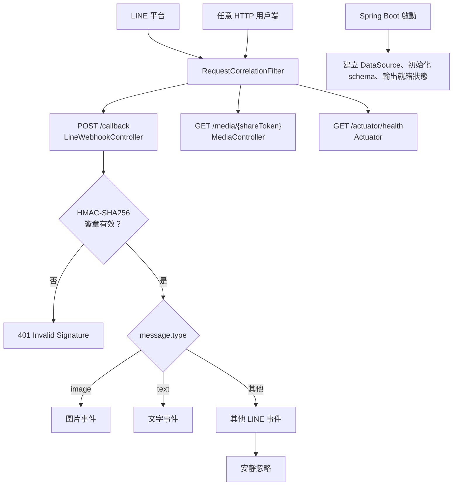
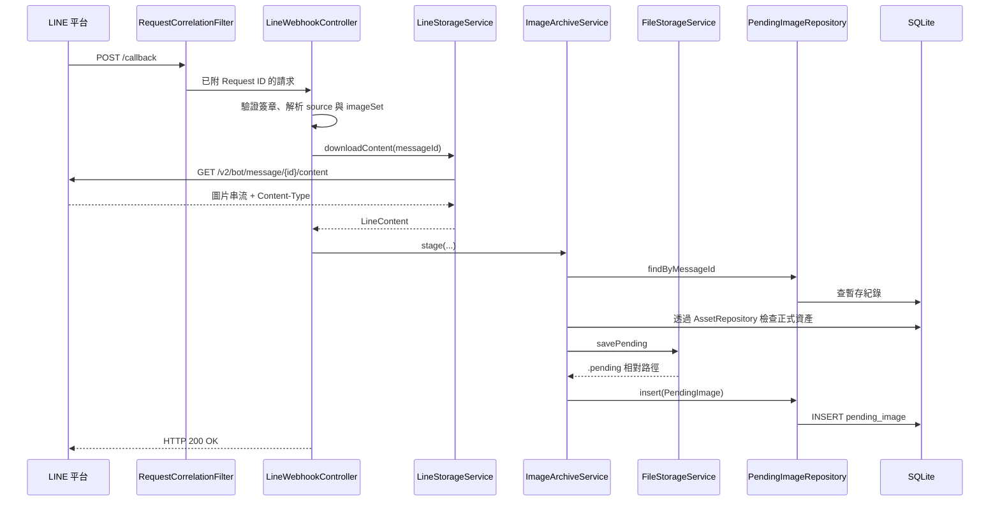
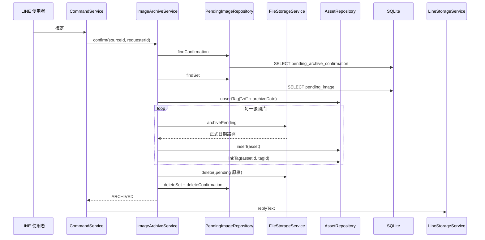
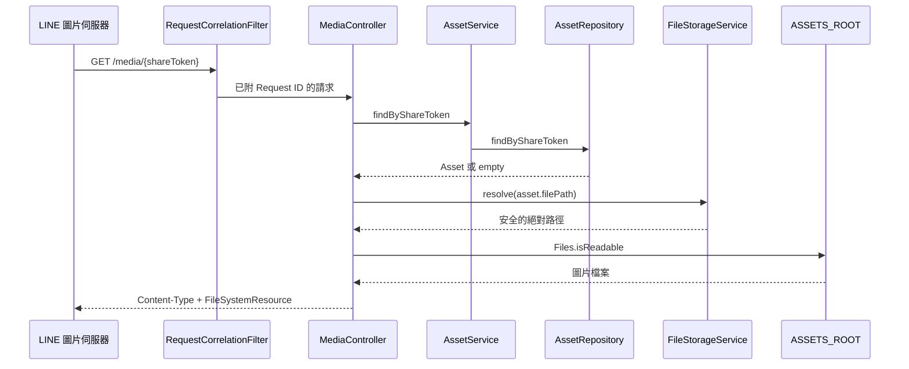

# 事件起點與完整呼叫鏈

本文件以「哪一個事件先發生」為起點，追蹤事件如何穿過 Controller、Service、
Repository、SQLite、磁碟與外部 API。若要理解單一類別的欄位與方法，再搭配
[類別索引](reference/index.md) 閱讀。

---

## 狀態圖例

| 標記 | 意義 |
|---|---|
| ✅ | 目前已接通且有測試覆蓋 |
| ⚠️ | 已進入流程，但會因設定或尚未實作而中止 |
| 🧩 | 資料契約或基礎設施已存在，尚未接到正式事件 |
| 🕰️ | 保留的舊式／程式化入口，目前沒有 Controller 呼叫 |

---

## 所有事件起點

| 事件起點 | 第一個專案類別 | 最終效果 | 狀態 |
|---|---|---|---|
| Spring Boot 啟動 | `AssetsManagerLinebotApplication` | 建立目錄、SQLite、資料表與啟動狀態日誌 | ✅ |
| 任意 HTTP 請求 | `RequestCorrelationFilter` | 建立 Request ID、交給後續端點、記錄結果 | ✅ |
| 任一 Spring 公開方法 | `MethodTraceLogger` | 記錄方法進入、完成／失敗與耗時 | ✅ |
| LINE 圖片訊息 | `LineWebhookController` | 下載圖片並暫存到 `.pending` | ✅ |
| 引用圖片輸入 `zdYYYYMMDD` | `LineWebhookController` | 檢查整組圖片並建立待確認歸檔 | ✅ |
| 輸入「確定／確認」 | `LineWebhookController` | 將整組圖片正式歸檔並建立資產索引 | ✅ |
| 輸入「取消」 | `LineWebhookController` | 清除待確認操作，圖片仍留在暫存區 | ✅ |
| 輸入 `#說明` | `LineWebhookController` | 回覆使用方式 | ✅ |
| 輸入 `#標籤` | `LineWebhookController` | 統計目前群組的標籤和圖片數 | ✅ |
| 輸入 `#查 標籤` | `LineWebhookController` | 查出圖片並回覆公開圖片網址 | ✅ |
| LINE 伺服器抓取圖片網址 | `MediaController` | 從磁碟串流圖片 | ✅ |
| 引用圖片輸入 `#報價` | `LineWebhookController` | AI 擷取規格，計算與輸出階段目前中止 | ⚠️ |
| `GET /actuator/health` | Spring Boot Actuator | 回覆容器健康狀態 | ✅ |
| 程式直接呼叫 `AssetService.ingest/tag` | `AssetService` | 直接收錄或替既有資產掛標籤 | 🕰️ |
| 程式直接建立報價輸出目錄 | `QuotationOutputDirectoryService` | 建立安全的案件資料夾 | 🧩 |

---

## 全域事件分派



每個 HTTP 請求都先經過 `RequestCorrelationFilter`。因此 LINE webhook、媒體抓圖與
健康檢查都會取得 `X-Request-ID`；但健康檢查不寫完成日誌，避免固定探測造成洗版。
進入 Controller、Service 或 Repository 公開方法時，`MethodTraceLogger` 會以 Aspect
包住方法執行，沿用同一個 Request ID 串起 `method_entered`、`method_completed`
或 `method_failed`。它不記錄參數或回傳值。

### 跨越所有功能的 AOP 方法追蹤

```text
RequestCorrelationFilter
└─ MDC.requestId
	└─ MethodTraceLogger.trace
		├─ event=method_entered
		├─ ProceedingJoinPoint.proceed
		│	└─ Controller／Service／Repository 原方法
		├─ event=method_completed
		└─ event=method_failed
```

沒有 HTTP Request ID 的啟動或背景方法會暫時使用 `background-{UUID}`。
設定 `METHOD_TRACING_ENABLED=false` 可停用這層追蹤。

---

## 事件 1：應用程式啟動

```text
AssetsManagerLinebotApplication.main
└─ SpringApplication.run
	├─ StorageConfig.dataSource
	│	├─ Files.createDirectories(ASSETS_ROOT)
	│	└─ HikariDataSource
	│		├─ SQLite JDBC URL
	│		├─ maximumPoolSize = 1
	│		└─ PRAGMA foreign_keys=ON
	├─ Spring SQL initializer
	│	└─ schema.sql
	│		├─ 資產與暫存資料表
	│		├─ 報價主檔與規則資料表
	│		├─ AI 請求與圖片選擇資料表
	│		└─ 報價快照與三種模板種子資料
	└─ ApplicationReadyEvent
		└─ OperationalStatusLogger.logApplicationReady
			├─ AiExtractionService.isConfigured
			├─ QuotationOutputDirectoryService.isConfigured
			└─ 記錄三項布林就緒狀態
```

`StorageConfig` 必須先建立資產根目錄，SQLite 才能建立 `assets.db`。連線池限制為
一條連線，是因為 SQLite 同一時間只有一個寫入者；外鍵則必須逐連線啟用。

---

## 事件 2：LINE 圖片訊息進入暫存區



完整方法鏈：

```text
RequestCorrelationFilter.doFilterInternal
└─ LineWebhookController.handleWebhook
	└─ handleEvent
		└─ handleImage
			├─ LineStorageService.downloadContent
			└─ ImageArchiveService.stage
				├─ PendingImageRepository.findByMessageId
				├─ AssetRepository.findByMessageId
				├─ FileStorageService.savePending
				└─ PendingImageRepository.insert
```

`messageId` 同時在暫存與正式資料中檢查，LINE 重送相同 webhook 時不會產生第二份檔案。
若暫存檔已寫入，但 SQLite 寫入失敗，`stage()` 會刪除該暫存檔，避免孤兒檔案。

---

## 事件 3：引用圖片輸入 `zdYYYYMMDD`

```text
LineWebhookController.handleEvent
└─ CommandService.handleText
	├─ ARCHIVE_CODE 驗證「zd + 8 位日期」
	└─ CommandService.requestArchive
		└─ ImageArchiveService.requestArchive
			├─ 驗證日期是否為真實日曆日期
			├─ PendingImageRepository.findByMessageId
			├─ 比對 quoted image 的 sourceId
			├─ PendingImageRepository.findSet
			├─ 比對已收到張數與 imageTotal
			└─ PendingImageRepository.saveConfirmation
				└─ UPSERT pending_archive_confirmation
```

成功後的回覆鏈：

```text
CommandService.requestArchive
└─ LineStorageService.replyText
	└─ LineStorageService.reply
		└─ LineStorageService.post
			└─ POST https://api.line.me/v2/bot/message/reply
```

可能分支：

| 狀態 | 原因 | LINE 回覆 |
|---|---|---|
| `READY` | 圖片已收齊、日期有效 | 顯示張數與目標日期，等待「確定」 |
| `INVALID_DATE` | 不是有效的日曆日期 | 提示正確格式 |
| `INCOMPLETE_SET` | `imageSet` 尚未收齊 | 顯示目前張數／預期張數 |
| `WRONG_SOURCE` | 引用的圖片不屬於目前來源 | 統一回覆找不到待歸檔圖片 |
| `NOT_FOUND` | 暫存資料不存在 | 提示重新上傳 |

---

## 事件 4：輸入「確定／確認」



完整方法鏈：

```text
CommandService.handleText
└─ CommandService.confirmArchive
	└─ ImageArchiveService.confirm
		├─ PendingImageRepository.findConfirmation
		├─ PendingImageRepository.findSet
		├─ AssetRepository.upsertTag
		├─ 每一張 PendingImage
		│	├─ FileStorageService.archivePending
		│	├─ AssetRepository.insert
		│	└─ AssetRepository.linkTag
		├─ FileStorageService.delete
		├─ PendingImageRepository.deleteSet
		└─ PendingImageRepository.deleteConfirmation
```

正式檔案名稱以圖片在 `imageSet` 內的順序產生，例如
`20260728/20260728-001.jpg`。若正式歸檔中途失敗，已建立的正式檔會被清除，
原始 `.pending` 檔案仍保留供重試。

---

## 事件 5：輸入「取消」

```text
CommandService.handleText
└─ ImageArchiveService.cancel
	├─ PendingImageRepository.findConfirmation
	└─ PendingImageRepository.deleteConfirmation
		└─ LineStorageService.replyText
```

取消只刪除「等待確認」狀態，不刪除 `.pending` 圖片或 `pending_image`。這能避免使用者
誤按取消後立即失去尚未歸檔的原圖。

---

## 事件 6：輸入 `#說明`

```text
CommandService.handleText
└─ CommandService.handleCommand
	└─ LineStorageService.replyText(HELP)
		└─ POST LINE reply API
```

別名包括 `#help` 與 `#?`。未知的井字號指令不回覆，避免在群組內洗版。

---

## 事件 7：輸入 `#標籤` 或 `#清單`

```text
CommandService.handleText
└─ CommandService.handleCommand
	└─ CommandService.replyTagList
		├─ AssetService.tagCounts
		│	└─ AssetRepository.tagCounts
		│		└─ SELECT tag + asset_tag + asset WHERE source_id = ?
		├─ AssetService.countBySource
		│	└─ AssetRepository.countBySource
		│		└─ SELECT COUNT(*) WHERE source_id = ?
		└─ LineStorageService.replyText
```

所有統計都帶 `sourceId`，因此同一個標籤名稱可以存在於不同群組，但查詢結果不會互通。

---

## 事件 8：輸入 `#查 標籤`

### 第一段：Bot 查詢並回覆圖片網址

```text
CommandService.handleText
└─ CommandService.handleCommand
	└─ CommandService.replySearch
		├─ 檢查 tags 非空
		├─ 檢查 PUBLIC_BASE_URL
		├─ 將查詢標籤轉成小寫
		├─ AssetService.search
		│	└─ AssetRepository.searchByTags
		│		├─ WHERE source_id = ?
		│		├─ WHERE tag IN (...)
		│		├─ HAVING COUNT(DISTINCT tag) = 查詢標籤數
		│		└─ AssetRepository.withTags
		└─ LineStorageService.reply
			├─ 文字摘要
			└─ 每筆資產的 /media/{shareToken} 圖片訊息
```

多個標籤是 AND，不是 OR。單次 reply 最多五則，因此預設是一則摘要加四張圖片。

### 第二段：LINE 伺服器抓取每張圖片



`shareToken` 是每筆資產獨立的隨機值，不使用可預測的資料庫流水號。即使 SQLite 的
`file_path` 被竄改，`FileStorageService.resolve()` 仍會阻止讀取資產根目錄以外的檔案。

---

## 事件 9：引用圖片輸入 `#報價`

```text
CommandService.handleText
└─ CommandService.handleCommand
	└─ CommandService.replyQuotation
		├─ 檢查 quotedMessageId
		├─ QuotationService.isAiConfigured
		├─ AssetService.findByMessageId
		│	└─ AssetRepository.findByMessageId
		├─ AssetService.contentOf
		│	├─ FileStorageService.resolve
		│	└─ Files.readAllBytes
		└─ QuotationService.quote
			├─ AiExtractionService.extract
			│	├─ buildRequestBody
			│	├─ callModel
			│	│	└─ POST OpenAI 相容 chat completions API
			│	├─ extractContent
			│	├─ parseJsonObject
			│	└─ validateRequiredFields
			├─ QuotationCalculator.calculate
			│	└─ ⚠️ 目前拋出 UnsupportedOperationException
			└─ QuotationPdfService.generate
				└─ ⚠️ 只有計算完成後才會到達；目前亦為佔位
```

目前實際結果：

1. AI 設定不完整：直接回覆設定缺漏。
2. 找不到引用圖片：提示重新上傳。
3. AI 呼叫或解析失敗：由 `AiExtractionException.userMessage()` 轉成使用者訊息。
4. AI 成功：顯示已辨識欄位，再提示「報價公式尚未定義」。
5. 計算與輸出完成：程式已有成功分支，但目前不會到達。

### 尚未接線的新版報價資料層

以下資源已存在並通過測試，但尚未由 `QuotationService` 使用：

```text
quotation-request.schema.json
├─ 限制 AI 只輸出方案、品項、數量、圖片評估與警告
└─ 刻意不允許 AI 決定價格

template-definitions.json
├─ CNS
├─ GENERAL／一般架
└─ MARINE／船用

schema.sql
├─ quotation_scheme / quotation_item / quotation_rule
├─ quotation_template
├─ quotation_request / quotation_request_image
└─ quotation / quotation_line

QuotationOutputDirectoryService
└─ 建立 {QUOTATION_ROOT_PATH}/報價單/{安全案件名稱}
```

也就是說，新版 Excel 契約、模板座標與 SQLite 報價快照已完成「資料設計」，
但還沒有 Repository、計算引擎、Excel 寫入器及正式事件串接。

---

## 事件 10：健康檢查

```text
Docker / docker compose
└─ GET /actuator/health
	├─ RequestCorrelationFilter
	│	└─ 不寫 http_request_completed 日誌
	└─ Spring Boot Actuator
		└─ 回覆 UP / DOWN
```

健康檢查由 Spring Boot Actuator 提供，不會進入專案自訂 Controller。

---

## 保留但未由目前事件呼叫的入口

### `AssetService.ingest`

```text
外部 Java 呼叫者
└─ AssetService.ingest
	├─ AssetRepository.findByMessageId
	├─ FileStorageService.save
	├─ AssetRepository.insert
	└─ AssetRepository.findByMessageId
```

這是圖片「立即落入當天正式資料夾」的舊式入口。目前 LINE webhook 改走
`ImageArchiveService.stage()`，先暫存、再等待日期確認。

### `AssetService.tag`

```text
外部 Java 呼叫者
└─ AssetService.tag
	├─ AssetRepository.findByMessageId
	├─ AssetRepository.upsertTag
	├─ AssetRepository.linkTag
	└─ AssetRepository.findByMessageId
```

目前日期歸檔流程會自動掛上 `zdYYYYMMDD`，所以 Controller 沒有直接呼叫 `tag()`；
此方法仍保留「同一張圖片掛多個標籤」的程式化能力。

---

## 故障邊界與回覆責任

| 層級 | 主要責任 | 失敗時行為 |
|---|---|---|
| `RequestCorrelationFilter` | Request ID 與請求完成日誌 | `finally` 仍會寫狀態與耗時 |
| `MethodTraceLogger` | 公開 Spring 方法的進入、完成與失敗追蹤 | 不記錄參數與回傳值，避免敏感資料進入日誌 |
| `LineWebhookController` | 驗簽、JSON 解析、事件分派 | 單一事件失敗不拖垮整批 webhook |
| `CommandService` | 將業務狀態翻成 LINE 文案 | 普通聊天與未知指令安靜忽略 |
| `ImageArchiveService` | 檔案與 SQLite 的歸檔協調 | 清理部分建立的正式檔，保留暫存來源 |
| `AssetRepository` | SQL 與群組資料隔離 | 例外交給上層交易處理 |
| `FileStorageService` | 路徑安全與檔案操作 | 阻擋根目錄外路徑 |
| `LineStorageService` | LINE 外部 HTTP 呼叫 | 記錄狀態碼或例外，不向上拋出 |
| `AiExtractionService` | AI 呼叫、解析、必要欄位驗證 | 統一拋出 `AiExtractionException` |
| `QuotationService` | 報價三階段串接 | 未完成階段回傳 `blockedStep` |

---

## 閱讀程式碼的建議順序

1. `LineWebhookController`：先看事件如何進入。
2. `CommandService`：看文字如何分派。
3. `ImageArchiveService`：看圖片生命週期。
4. `PendingImageRepository`、`AssetRepository`：看資料如何保存與隔離。
5. `FileStorageService`：看磁碟結構與路徑安全。
6. `MediaController`、`LineStorageService`：看 LINE 如何取回圖片。
7. `QuotationService`、`AiExtractionService`：看報價的完成與未完成邊界。
8. `schema.sql`：最後看完整資料模型與新版報價資料層。
