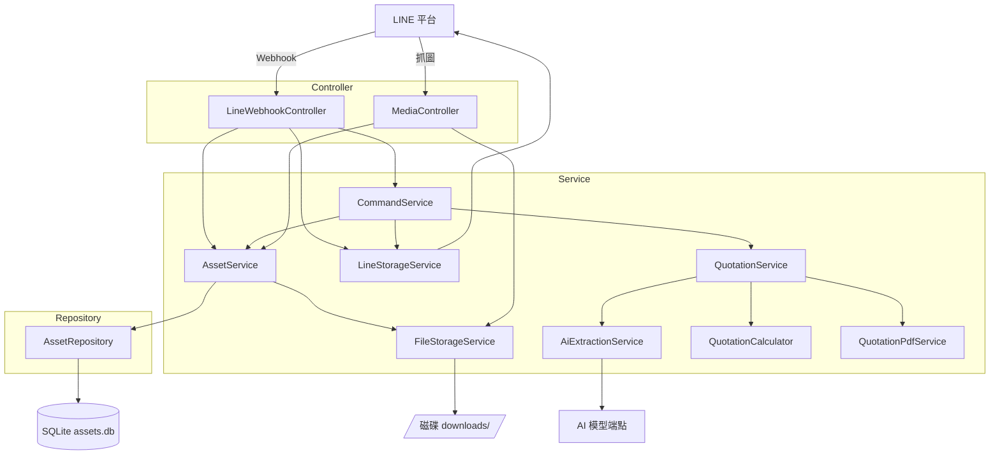

# 專案類別索引（Class Reference Index）

> 內部維護文件。新增或刪除類別時，**同一個 PR 內**必須更新本頁與對應的分類頁，
> 規則見 [../03-versioning-release-sop.md](../03-versioning-release-sop.md)。

適用版本：`@assets-manager-linebot@0.1.0`

---

## Navigator

依 Java 類別型態分類，點擊進入該型態的詳細頁。

| 型態 | 說明 | 數量 | 詳細頁 |
|---|---|---|---|
| Application | 應用程式進入點 | 1 | [01-application.md](01-application.md) |
| Configuration | Spring bean 定義與基礎設施組裝 | 1 | [02-configuration.md](02-configuration.md) |
| Controller | HTTP 端點，系統對外的入口 | 2 | [03-controller.md](03-controller.md) |
| Service | 業務邏輯 | 8 | [04-service.md](04-service.md) |
| Repository | 資料庫存取 | 1 | [05-repository.md](05-repository.md) |
| Record | 不可變資料載體 | 6 | [06-record.md](06-record.md) |
| Exception | 自訂例外 | 1 | [07-exception.md](07-exception.md) |
| Test | 測試類別 | 3 | [08-test.md](08-test.md) |

---

## 全類別快速索引（依字母）

| 類別 | 型態 | 一句話職責 |
|---|---|---|
| [`AiExtractionException`](07-exception.md#aiextractionexception) | Exception | 表達 AI 資料提取失敗與缺漏欄位 |
| [`AiExtractionService`](04-service.md#aiextractionservice) | Service | 把規格圖送給 AI 模型並整理回應 |
| [`Asset`](06-record.md#asset) | Record | 一筆資產索引的不可變快照 |
| [`AssetRepository`](05-repository.md#assetrepository) | Repository | 資產索引的唯一資料庫出入口 |
| [`AssetService`](04-service.md#assetservice) | Service | 資產生命週期協調：收錄→歸檔→查詢 |
| [`AssetsManagerLinebotApplication`](01-application.md#assetsmanagerlinebotapplication) | Application | 應用程式進入點 |
| [`CommandService`](04-service.md#commandservice) | Service | 群組文字指令解析與回覆組裝 |
| [`ExtractedSpec`](06-record.md#extractedspec) | Record | AI 讀出的結構化規格欄位 |
| [`FileStorageService`](04-service.md#filestorageservice) | Service | 圖片在磁碟上的落地、搬移與路徑安全 |
| [`LineStorageService`](04-service.md#linestorageservice) | Service | 與 LINE Messaging API 的唯一往來出口 |
| [`LineWebhookController`](03-controller.md#linewebhookcontroller) | Controller | LINE Webhook 接收、驗簽、分派 |
| [`MediaController`](03-controller.md#mediacontroller) | Controller | 對外提供資產圖片給 LINE 抓取 |
| [`QuotationAmounts`](06-record.md#quotationamounts) | Record | 報價金額結果（佔位） |
| [`QuotationCalculator`](04-service.md#quotationcalculator) | Service | 規格換算報價金額（**佔位，公式未定**） |
| [`QuotationPdfService`](04-service.md#quotationpdfservice) | Service | 套模板產出報價單（**佔位，模板未提供**） |
| [`QuotationService`](04-service.md#quotationservice) | Service | 報價流程串接：提取→計算→產 PDF |
| [`StorageConfig`](02-configuration.md#storageconfig) | Configuration | 建立 SQLite 資料來源並確保目錄存在 |

---

## 分層關係

### 分層規則

1. **Controller 不含業務判斷**。看懂請求之後就往下丟，錯誤處理與回覆文案屬於 Service。
2. **只有 `AssetService` 同時碰檔案系統與資料庫**。兩者的一致性由它在同一個交易內負責。
3. **只有 `LineStorageService` 對 LINE 發 HTTP**，channel token 也只出現在那裡。
4. **只有 `AssetRepository` 寫 SQL**。其他層看到的是 `Asset` 與 Java 型別。
5. **所有查詢必須帶 `sourceId`**，否則不同群組的資產會互相看見。
